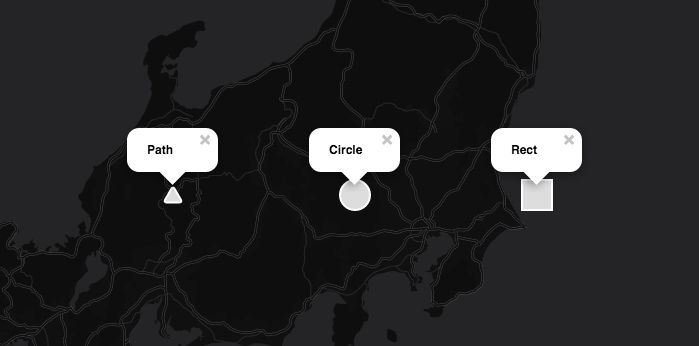

# Leaflet.VectorIcon

A plugin for Leaflet to make pure svg icon for markers.

## Demo



Live demo at [http://muxlab.github.io/Leaflet.VectorIcon/demo.html](http://muxlab.github.io/Leaflet.VectorIcon/demo.html)

## Usage

Load the script.

```html
<script src="L.VectorIcon.js"></script>
```

`L.VectorIcon` support three types of the svg shape:

* `<path>`
* `<circle>`
* `<rect>`
* `<text>`

W3C page ([Basic Shapes](https://www.w3.org/TR/SVG/shapes.html)) for more information on svg shapes.


### Path

```js
var pathIcon = L.vectorIcon({
  className: 'my-vector-icon',
  svgHeight: 32,
  svgWidth: 32,
  type: 'path',
  shape: {
    d: 'M23.963,20.834L17.5,9.64c-0.825-1.429-2.175-1.429-3,0L8.037,20.834c-0.825,1.429-0.15,2.598,1.5,2.598h12.926C24.113,23.432,24.788,22.263,23.963,20.834z'
  },
  style: {
    fill: '#ddd',
    stroke: '#fff',
    strokeWidth: 2
  }
});

var pathMarker = L.marker([36, 137], { icon: pathIcon }).addTo(map);
```

### Circle

```js
var circleIcon = L.vectorIcon({
  className: 'my-vector-icon',
  svgHeight: 32,
  svgWidth: 32,
  type: 'circle',
  shape: {
    r: '15',
    cx: '16',
    cy: '16'
  },
  style: {
    fill: '#ddd',
    stroke: '#fff',
    strokeWidth: 2
  }
});

var circleMarker = L.marker([36, 139], { icon: circleIcon }).addTo(map);
```

### Rect

```js
var rectIcon = L.vectorIcon({
  className: 'my-vector-icon',
  svgHeight: 32,
  svgWidth: 32,
  type: 'rect',
  shape: {
    x: '1',
    y: '1',
    width: '30',
    height: '30'
  },
  style: {
    fill: '#ddd',
    stroke: '#fff',
    strokeWidth: 2
  }
});

var rectMarker = L.marker([36, 141], { icon: rectIcon }).addTo(map);
```

### Text

```js
var textIcon = L.vectorIcon({
  className: 'my-vector-icon',
  svgHeight: 32,
  svgWidth: 50,
  type: 'text', // path | circle | rect | text
  shape: {
    x: '25',
    y: '24'
  },
  style: {
    fill: '#ddd',
    //stroke: '#fff',
    strokeWidth: 2,
    fontFamily: 'Helvetica',
    fontSize: '16',
    fontWeight: '100'
  },
  text: 'Hello!'
});

var textMarker = L.marker([36, 141], { icon: textIcon }).addTo(map);
```

## License
Copyright 2016 MUX Lab.

MIT.
